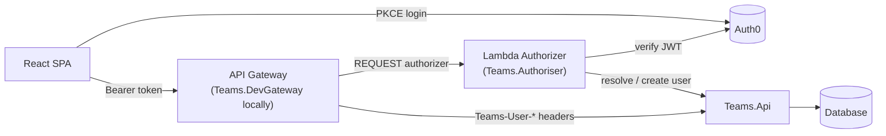

# Pick Your Teams

Organise five-a-side (or any-a-side) games: create a game, invite players by tag, auto-generate
balanced teams from player ratings, and record results to feed the next game's ratings.

- **UI** — React + Vite + TypeScript, Tailwind + shadcn/ui, TanStack Query, react-router
- **API** — ASP.NET Core, EF Core, a small home-rolled CQRS mediator (see [docs/cqrs.md](docs/cqrs.md))
- **Auth** — Auth0, fronted by a real local mirror of AWS API Gateway + a Lambda authorizer
  (see [docs/auth-flow.md](docs/auth-flow.md))



## Getting started

```sh
# One-time: build the auth-chain projects
cd src/authoriser && dotnet build && cd ../gateway && dotnet build && cd ../..

# Copy src/ui/.env.example to src/ui/.env.local and fill in the Auth0 dev tenant details

npm run dev:all
```

Starts the API, the local authorizer, the local dev gateway, and the UI dev server together. See
[docs/local-dev-topology.md](docs/local-dev-topology.md) for running pieces individually, the
ports involved, and debugging the authorizer directly.

## Documentation

- [docs/architecture.md](docs/architecture.md) — system diagram, backend/frontend layering, testing
- [docs/auth-flow.md](docs/auth-flow.md) — how a request gets from the browser to `Teams.Api`
- [docs/cqrs.md](docs/cqrs.md) — the home-rolled request/handler mediator
- [docs/data-model.md](docs/data-model.md) — entity relationships and running migrations
- [docs/local-dev-topology.md](docs/local-dev-topology.md) — running everything locally
- [docs/ui-design/](docs/ui-design/) — the original Excalidraw screen designs
- [claude.md](claude.md) — the living record of established conventions and patterns; read this
  before making changes to the UI or API

## Workflow

One branch per unit of work off the latest `main`; a backend-only change gets its own branch,
merged before any frontend work that depends on it. Commit in small, logical chunks, following
[Conventional Commits](https://www.conventionalcommits.org/) (enforced by commitlint). Push and
open a draft PR — never push directly to `main`.
