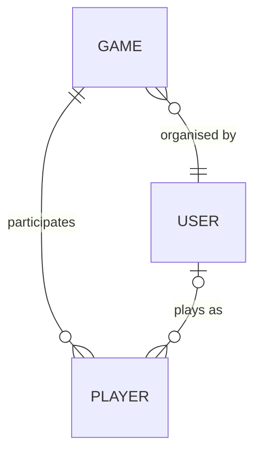

# Pick Your Teams

## Migrations

We use separate startup and data projects, so running a migration requires a couple of extra parameters:

```sh
# Commands relative to /src directory

# Add Migration
dotnet ef migrations add <name> --project ./Teams.Data --startup-project ./Teams.Api --output-dir Context/Migrations

# Remove Migration
dotnet ef migrations remove --project ./Teams.Data --startup-project ./Teams.Api

# Apply Migration
dotnet ef database update --project ./Teams.Data --startup-project ./Teams.Api
```

> ℹ️ We use separate read and write contexts, if that is enforced by connection string (as is the case for the default 
> SQLite), be sure to update the read string to be writable.  For example:
> 
> Before: ```"Reader": "Data Source=../../teams.db;mode=ReadOnly",```
> 
> After: ```"Reader": "Data Source=../../teams.db",```
 

