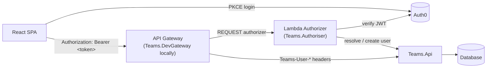
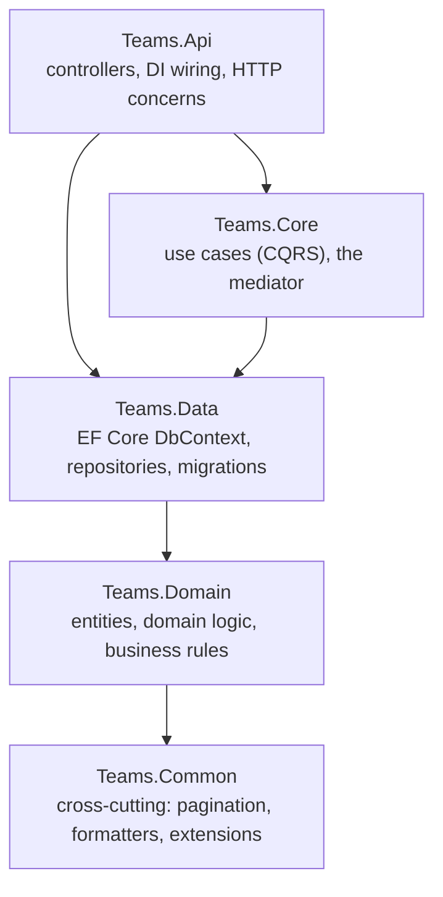

# Architecture

## System overview

In production, the SPA talks directly to an AWS API Gateway with a custom Lambda authorizer
attached — there's no backend-for-frontend. Locally, `Teams.DevGateway` and
`Teams.Authoriser.LocalHost` play those two roles for real, not as fakes; see
[local-dev-topology.md](local-dev-topology.md) for running it and
[auth-flow.md](auth-flow.md) for what happens on every request.

A full AWS-specific version of this diagram is in `docs/arch-design/aws-design.png`.

## Backend layering

`src/api` is a straightforward layered solution — dependencies only point one direction:

- **`Teams.Domain`** owns the entities (`User`, `Game`, `Player`, `Invitation`) and the business
  logic that belongs on them directly — team generation, Elo-style rating changes, invitation
  state transitions. See [data-model.md](data-model.md).
- **`Teams.Data`** is EF Core: `DbContext`, repositories, migrations. Read/write use separate
  contexts (see the migrations note in [data-model.md](data-model.md)).
- **`Teams.Core`** holds every use case under `UseCases/<Area>/<Verb>/`, dispatched through a
  small home-rolled CQRS mediator instead of a MediatR dependency — worth a read on its own, see
  [cqrs.md](cqrs.md).
- **`Teams.Api`** is thin: controllers translate HTTP into a `SendAsync` call and back, no
  business logic of its own. `Attributes`/`Infrastructure` carry cross-cutting concerns like the
  `[RequiresScope]` gate described in [auth-flow.md](auth-flow.md).
- **`Teams.Common`** is genuinely cross-cutting (pagination, formatters, provider abstractions) —
  referenced by every layer above it, doesn't reference anything itself.

Each project has an `*.UnitTests` sibling; `Teams.Api.IntegrationTests` and
`Teams.Api.EndToEndTests` sit alongside `Teams.Api` for the wider test types (see
"Testing" below).

## Frontend layering

`src/ui/src` keeps non-visual code separate from components on purpose — it costs nothing now and
avoids a rewrite if this ever needs to become a native app later:

- **`api/`** — the HTTP client and endpoint wrappers. Response bodies are camelCase; request
  bodies and query params stay PascalCase, matching the C# DTOs directly.
- **`hooks/`** — TanStack Query hooks (all data fetching/caching/mutations go through these, never
  ad hoc `fetch`), plus page-level hooks like `usePageTitle`/`usePageFooterActions`.
- **`lib/`** — framework-agnostic helpers and validation.
- **`components/`** / **`pages/`** — the actual React tree. Routing is `react-router`, nested to
  match the real screen hierarchy (Game → Players → Invite is three real route levels, not tab
  state).

See `claude.md`'s "Established patterns" section for the conventions that hold this together
(the page-title/footer-action hook contract, the `Sheet` confirmation pattern, team colour coding,
`staleTime` on shared queries, and more) — that file is the living record of *how* to build a new
screen; this one is about how the pieces fit together.

## Testing

| Layer | Tool | Notes |
|---|---|---|
| API unit | xUnit v3 + NSubstitute | One `*.UnitTests` project per `src/api` project |
| API integration | xUnit v3 | `Teams.Api.IntegrationTests`, real `Teams.Api` + test DB |
| API end-to-end | xUnit v3 | `Teams.Api.EndToEndTests`, seeded users via `ActorResolverMiddleware` (see [local-dev-topology.md](local-dev-topology.md)) |
| Authoriser | xUnit v3 + NSubstitute | `Teams.Authoriser.UnitTests`, including real signature verification against a self-signed test cert |
| UI unit/component | Vitest + React Testing Library | `npm run test` in `src/ui` |
| UI end-to-end | Playwright | Planned, not yet built — see `claude.md`'s "End-to-end testing" section for the agreed direction |

CI (`.github/workflows/`) runs API build+test with coverage (`build-and-test.yml`, commented onto
PRs), `dotnet format --verify-no-changes` (`dotnet-linting.yml`), the UI build+test
(`ui-build-and-test.yml`), and commit-message linting against Conventional Commits
(`commit-linting.yml`, also enforced locally via `.husky/commit-msg`).

## Further reading

- [auth-flow.md](auth-flow.md) — the authorizer chain in detail, with a sequence diagram
- [cqrs.md](cqrs.md) — the home-rolled mediator
- [data-model.md](data-model.md) — entity relationships and running migrations
- [local-dev-topology.md](local-dev-topology.md) — running every piece locally
- `docs/ui-design/` — the original Excalidraw screen designs (source of truth for visual design
  except where `claude.md`'s "Screen reference" section explicitly overrides them)
