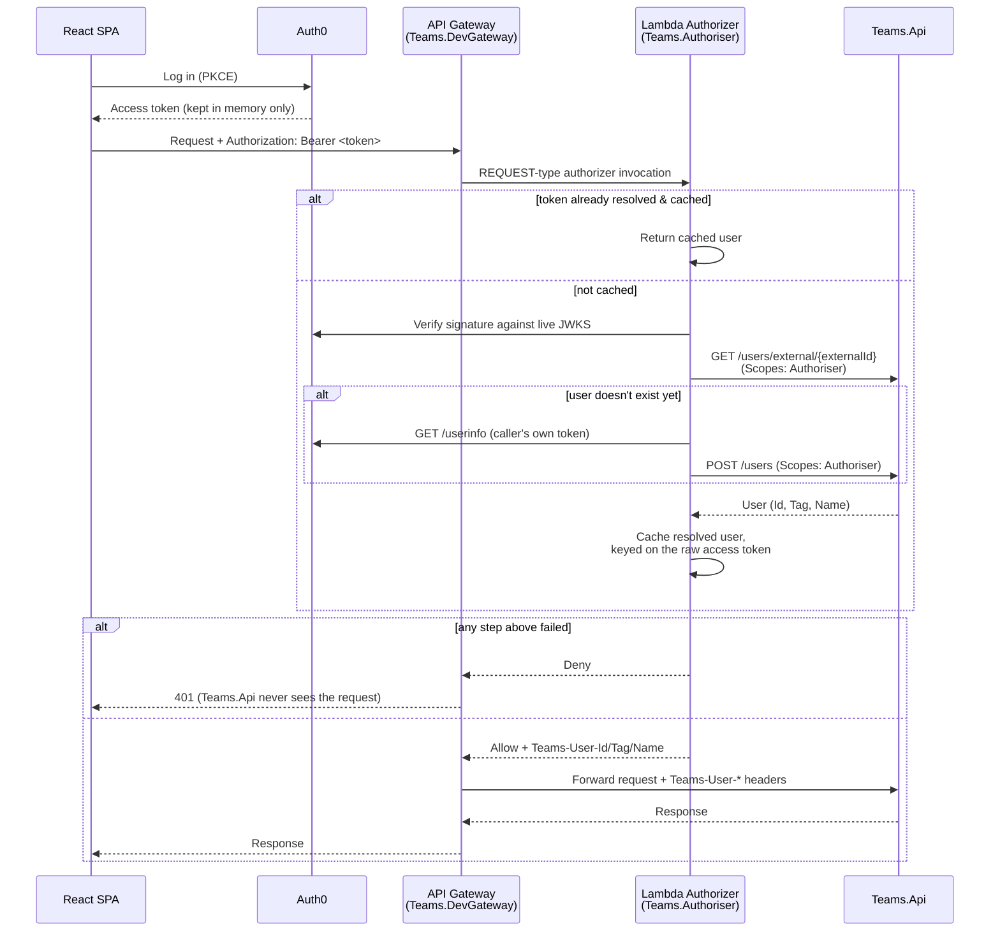

# Auth flow

There is no custom backend-for-frontend. The SPA talks directly to an API Gateway with a custom
Lambda authorizer attached (`docs/arch-design/aws-design.png`); locally, `Teams.DevGateway` and
`Teams.Authoriser.LocalHost` play those two roles for real (see
[local-dev-topology.md](local-dev-topology.md) for running them). The SPA only ever holds and
sends its own Auth0 access token — it never sees, sets, or needs to know about the
`Teams-User-*` headers the authorizer produces.

## What's real, what's cached

- **Signature verification never caches.** Every request re-verifies the JWT against Auth0's live
  JWKS — there's little point caching that inside a Lambda-shaped component. Only the *resolved
  user* is cached, per access token (`ICacheClient.GetOrCreateAsync`, an in-memory `CacheClient`
  today — deliberately not `IDistributedCache`, since that's a real decision to make if/when this
  needs to survive across multiple warm Lambda instances, not one to abstract over prematurely).
- **Cache lifetime is `min(remaining token lifetime, 15 minutes)`** (`CacheExpiryCalculator`), so a
  cached resolution is never served past the point its own token would fail verification anyway.
- **Any failure anywhere in the chain denies.** Missing/malformed header, bad signature, expired
  token, user lookup failure — there's no partial-success state.
- **First login auto-creates the user.** A resolved user with no existing `Teams.Api` record is
  created from the token's own Auth0 `/userinfo` profile (the caller's own access token, not a
  separate machine credential) and gets `Tag == Id` — the signal the SPA uses to redirect into
  tag-setup.

## The `Scopes` header

`GET /users/external/{externalId}` and `POST /users` are the only two endpoints an authorizer may
call — gated by `[RequiresScope(Scopes.Authoriser)]` against a `Scopes` header
(`Teams.Common.Constants.ScopeHeaderKey`). This isn't a new credential to manage: it relies on the
same trust boundary the `Teams-User-*` headers already do — nothing but the gateway can reach
`Teams.Api` directly (see the AWS diagram: the API Lambda has no inbound path except from API
Gateway and the Authorizer). `Teams.DevGateway` strips any client-supplied `Scopes` header
unconditionally before forwarding, and only ever sets it from the authorizer's own response, which
is always empty for a real end-user request.
