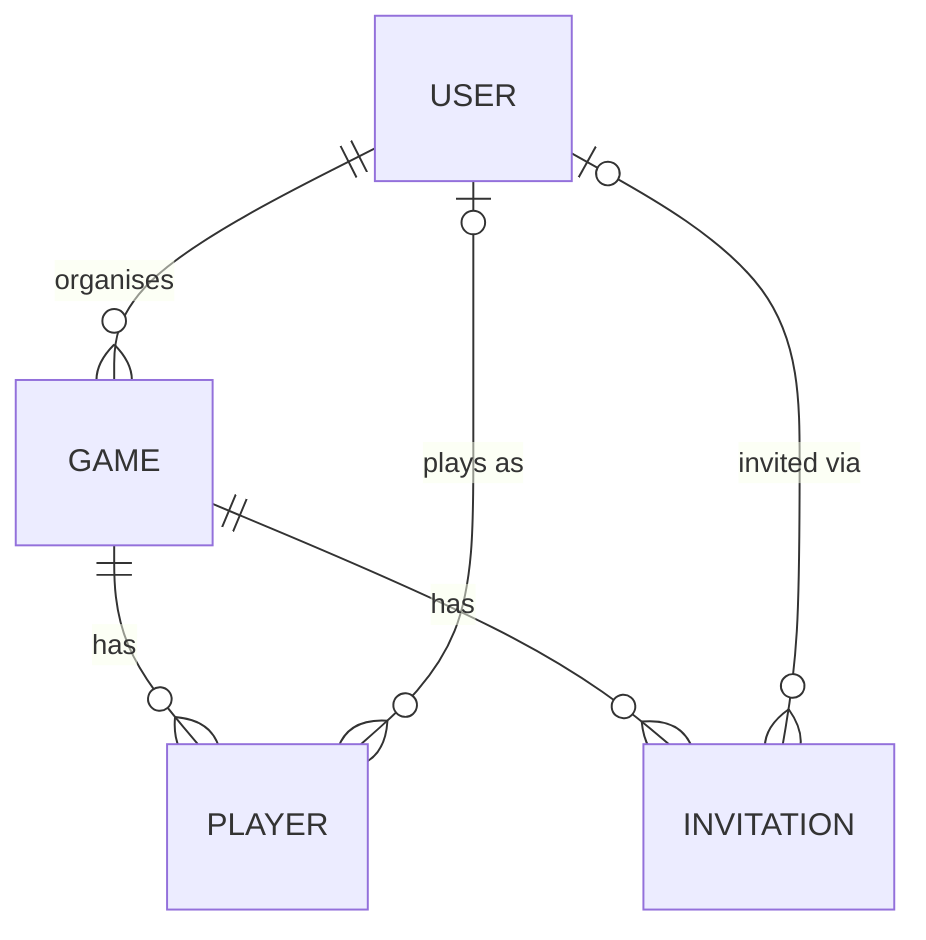

# Data model

`Teams.Domain` (`src/api/Teams.Domain/Entities`) owns four entities. Everything else — the EF Core
`DbContext`, repositories, migrations — lives in `Teams.Data` and maps onto these unchanged.



- **User** — `ExternalId` links to the Auth0 subject (see [auth-flow.md](auth-flow.md)). `Tag` is a
  unique handle; a new user is created with `Tag == Id`, which is the app-wide signal for
  "hasn't finished tag setup yet." `Rating` starts at 1000 and moves via the Elo-style calculation
  in `Game.SetResult`.
- **Game** — has a `TeamSize` (so `MaxPlayers == TeamSize * 2`), a `Status`
  (`Scheduled`/`Finished`), and an optional `Organiser` (`User`). Home/Away team ratings and rating
  *changes* are computed, not stored inputs — `HomeTeamRatingChange`/`AwayTeamRatingChange` are
  lazily calculated once a result is recorded.
- **Player** — represents one participant in one game. Either a **User player** (`UserId` set,
  `Type == User`) or a **Dummy player** (`UserId == null`, `Type == Dummy`, identified by
  `DisplayName` instead). `Team` is `Home`/`Away`/`None`; `Rating` is fixed at the moment a player
  is assigned to a team (`AssignTeam`), not read live off `User.Rating` afterwards, so a game's
  scoring can't shift underfoot if a player's rating changes between assignment and result.
- **Invitation** — belongs to a `Game`, targets a `User` by `Tag`/email, and moves through
  `Open` → `Accepted`/`Declined`/`Failed`. `Failed` is set server-side without surfacing as an
  error to the caller when the invitee already has a `Player` row in that game by the time they
  act — see the "Invitations" note in [claude.md](../claude.md).

## Migrations

`Teams.Data` and `Teams.Api` are separate projects, so running a migration needs both specified:

```sh
# Commands relative to /src/api

# Add a migration
dotnet ef migrations add <name> --project ./Teams.Data --startup-project ./Teams.Api --output-dir Context/Migrations

# Remove the last (unapplied) migration
dotnet ef migrations remove --project ./Teams.Data --startup-project ./Teams.Api

# Apply migrations
dotnet ef database update --project ./Teams.Data --startup-project ./Teams.Api
```

> ℹ️ Read and write use separate DB contexts. If that's enforced at the connection-string level
> (as it is for the default SQLite dev database), the *reader* string needs to be writable before
> `database update` will work:
>
> Before: `"Reader": "Data Source=../../teams.db;mode=ReadOnly"`
>
> After: `"Reader": "Data Source=../../teams.db"`
>
> Revert it once the migration's applied.
