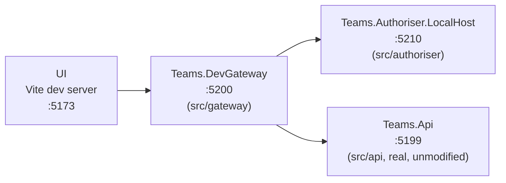

# Local dev topology

Mirrors the production shape in `docs/arch-design/aws-design.png` minus AWS itself: the UI logs in
via real Auth0, and every request runs through a real reverse proxy and a real authorizer before
reaching the real, unmodified `Teams.Api`. See [auth-flow.md](auth-flow.md) for what actually
happens inside that chain.



`Teams.DevGateway` and `Teams.Authoriser` are their own solutions under `src/gateway` and
`src/authoriser` — not part of `Teams.sln`. Both are still covered by `dotnet-linting.yml`, and
`Teams.Authoriser`'s tests run with coverage in `build-and-test.yml`; `Teams.DevGateway` has no
tests of its own — it's a dev tool, not a shipped component. Neither is deployed anywhere;
`Teams.Authoriser` is built against the real AWS Lambda authorizer request/response shape
(`Amazon.Lambda.APIGatewayEvents`, a REQUEST-type custom authorizer) so it's redeployable to a
real Lambda unchanged, but nothing here does that deployment.

## Running everything

One-time setup:

```bash
cd src/authoriser && dotnet build
cd src/gateway && dotnet build
```

Then, from the repo root:

```bash
npm run dev:all
```

Starts all four processes (`Teams.Api`, `Teams.Authoriser.LocalHost`, `Teams.DevGateway`, the UI
dev server) with labeled, merged console output via `concurrently`. `Ctrl+C` stops all four.

To run them individually instead:

```bash
dotnet run --project src/api/Teams.Api                              # :5199
dotnet run --project src/authoriser/Teams.Authoriser.LocalHost      # :5210
dotnet run --project src/gateway/Teams.DevGateway                   # :5200
npm run dev --prefix src/ui                                         # :5173, proxies /api -> :5200
```

`npm run dev` (in `src/ui`) points the Vite dev proxy at `Teams.DevGateway`
(`VITE_PROXY_TARGET` in `.env.development`). `npm run prod` runs the same dev server in production
mode (`.env.production`) instead — a stand-in for pointing at a real AWS API Gateway once one's
deployed; until then it points straight at `Teams.Api`, so protected calls will 401 (nothing sets
the `Teams-User-*` headers on that path), but unauthenticated behaviour can be sanity-checked and
the dev/prod switch itself is proven to work.

Auth0 config for local dev goes in `src/ui/.env.local` (gitignored — copy `.env.example` and fill
in the domain/client ID/audience for the dev tenant).

Useful `src/ui` commands on their own:

```sh
npm run dev    # start the dev server
npm run build  # typecheck and build
npm run test   # run the Vitest suite
npm run lint   # oxlint
```

## What each piece does

- **`Teams.Authoriser`** (`src/authoriser/Teams.Authoriser`) — the real Lambda handler. On every
  request: parses the `Authorization` header, verifies the JWT for real against Auth0's live JWKS
  (fetched fresh every call, no caching at that step), then resolves the verified token to a
  `Teams.Api` user (cached — see [auth-flow.md](auth-flow.md)). Any failure anywhere denies. All
  the real logic lives in `Auth/` and `Caching/` as small, independently unit-tested modules;
  `Function.cs` itself is a thin, untested orchestrator.
- **`Teams.Authoriser.LocalHost`** — the thing you actually run locally: a tiny ASP.NET Core app
  with one endpoint, `POST /authorize`, that deserializes the body into the same request type API
  Gateway would build, calls `Function.FunctionHandler` with a `TestLambdaContext`
  (`Amazon.Lambda.TestUtilities`), and serializes the response back. No SAM CLI, no LocalStack, no
  AWS CLI.
- **`Teams.DevGateway`** — a plain reverse proxy (ASP.NET Core minimal API + YARP) playing API
  Gateway's role. Builds the same request shape API Gateway would send a REQUEST-type authorizer,
  `POST`s it to `Teams.Authoriser.LocalHost`, and either returns `401` immediately (`Teams.Api`
  never sees the request) or translates the resolved user into `Teams-User-Id`/`Tag`/`Name`
  headers and forwards through. `appsettings.json`'s `Authoriser:BaseUrl` and
  `ReverseProxy:Clusters:teams-api` point at the two services above.

## Manually debugging `Teams.Authoriser`

For interactive debugging — stepping through the JWKS/signature/resolution logic with a real
captured token, separately from `Teams.Authoriser.LocalHost`'s automated per-request calls — use
AWS's own **Amazon.Lambda.TestTool** (installed as a local dotnet tool, see
`src/authoriser/.config/dotnet-tools.json`):

```bash
cd src/authoriser
dotnet tool run dotnet-lambda-test-tool-10.0 -- --path Teams.Authoriser
```

This opens a browser UI (a Blazor Server app with no REST endpoint of its own) where you can paste
a JSON payload (an `APIGatewayCustomAuthorizerRequest` with a real `Authorization` header) and step
through the function with a debugger attached.

## The API-only bypass

For work that only touches `Teams.Api` and doesn't need the full chain above, hit it directly with
`Teams-User-*` headers set manually — the same trust-boundary bypass `Teams.Api.EndToEndTests`
uses via `ActorResolverMiddleware` (25 seeded users). See `claude.md`'s "Auth model" section for
why that's a legitimate shortcut here and not a workaround for something broken.
